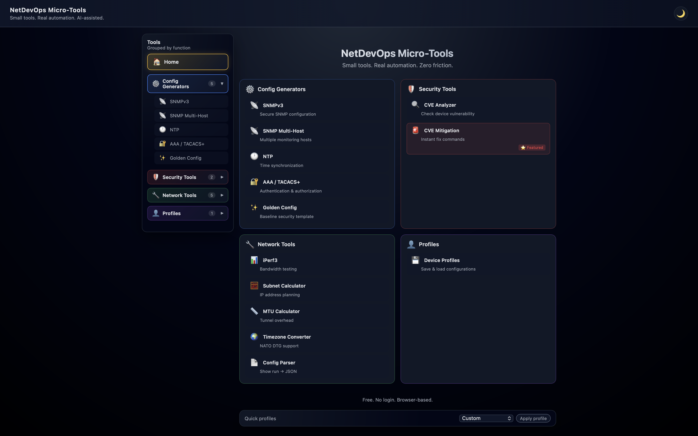

# NetDevOps Micro-Tools


**Small tools. Real automation. AI-assisted.**

🚀 **Live:** https://netdevops-tools.thebackroom.ai

📧 **Pricing & Updates:** https://netdevops.thebackroom.ai/



A **micro-SaaS backend + Web UI** for generating **secure Cisco IOS / IOS XE configurations**,
performing **security analysis** (CVE awareness), and **network calculations**.

This project is built publicly as an engineering-focused product prototype, with emphasis on:
- secure-by-default configuration patterns,
- repeatability via profiles,
- clean API design (FastAPI),
- and gradual evolution toward a SaaS-style architecture.

> ⚠️ **Disclaimer**  
> CVE data included in this project is **demo / curated only** and must not be treated as a production security authority.
> Always consult official Cisco advisories for real-world decisions.

---

## 🚀 Why this project exists

As network engineers, we often:
- copy-paste configuration snippets from old devices,
- re-type the same secure baselines again and again,
- rely on ad-hoc scripts with no UI or consistency,
- lack quick visibility into *“is this IOS XE version already known-bad?”*

NetDevOps Micro-Tools aims to solve this by providing:
- opinionated but configurable secure defaults,
- reusable **device profiles**,
- a simple **Web UI** on top of a versioned API,
- and a clear path toward automation or SaaS deployment.

---

## ✨ Core Features

### 🔧 Configuration Generators

#### SNMPv3 Generator
- Secure defaults, balanced and legacy-compatible modes
- SHA / AES-based configuration
- CLI or one-line output formats

#### NTP Generator
- Primary and secondary servers
- Optional authentication
- Timezone configuration

#### AAA / TACACS+ Generator
- TACACS+ with local fallback
- Local-only mode
- Optional source-interface support

#### Golden Config Builder
- Combine SNMPv3 / NTP / AAA snippets
- Modular baseline sections (Banner, Logging, Security)
- Custom banner text support
- Designed to evolve into compliance / drift detection workflows

### 🧮 Network Tools

#### iPerf3 Command Generator
- TCP/UDP throughput tests
- Link speeds: 100M / 1G / 10G
- Directions: upload / download / bidirectional
- Multi-platform output: Commands / Bash / PowerShell / Python
- Hints panel with quick reference

#### IP Subnet Calculator
- Subnet info (network, broadcast, host range)
- Subnet splitting and supernetting
- CIDR ↔ Netmask conversion
- Full CIDR reference table (/8 to /32)

#### MTU Calculator
- Tunnel overhead calculation
- Supports: GRE, IPSec, VXLAN, MPLS, LISP, GRE over IPSec
- TCP MSS recommendations
- Cisco config suggestions

#### Timezone Converter
- Convert timestamps across 12 common timezones
- **NATO DTG format** (military date-time groups)
- Date picker UI for easy selection
- Batch conversion support

#### Config Parser
- Parse `show running-config` to structured JSON
- Extracts: hostname, interfaces, SNMP, NTP, AAA, users, banners
- Summary mode for quick stats

### 💻 CLI Tool (v0.4.3)

Terminal interface for power users:
```bash
pip install click requests
python cli.py snmpv3 --host 10.0.0.1 --user monitoring
python cli.py subnet info 192.168.1.0/24
python cli.py cve --platform "Cisco IOS XE" --version 17.3.1
```

---

## 🔐 Security Tools

### CVE Analyzer & Security Score

A lightweight CVE awareness engine focused on Cisco platforms with NVD enrichment.

**Capabilities:**
- Platform + software version matching
- Severity classification (critical / high / medium / low)
- Upgrade recommendations based on known fixed versions
- **Security Score** (0-100) per device profile
- **Export** security reports (PDF, JSON, Markdown)
- Real-time NVD API enrichment

**Key features:**
- **Profiles × CVE** — batch vulnerability checking across all device profiles
- **Security Score** — numeric assessment with CVE breakdown and modifiers
- **Multi-format Export** — PDF, JSON, and Markdown reports
- **File-based cache** — NVD responses cached for 24h (eliminates rate limiting)

### 🛡️ CVE Mitigation Advisor ⭐ NEW

**The killer feature — zero competition in this space.**

When a critical CVE drops, you need actionable commands NOW, not 10-page advisories.

**19 CVEs in database** covering:
- Cisco IOS-XE (including CVE-2023-20198, CVSS 10.0)
- ASA/FTD firewalls
- Nexus switches
- WLC controllers
- Small business routers (RV series)
- UCS/IMC servers

**For each CVE you get:**
- Risk summary (1 sentence)
- Attack vector explanation
- **Workaround steps with copy-paste commands**
- Detection commands
- Verification commands
- Links to Cisco PSIRT advisories

**API Endpoints:**
```
GET /mitigate/cve/{id}      # Get mitigation for specific CVE
GET /mitigate/list          # List all CVEs with mitigations
GET /mitigate/critical      # Critical CVEs only
GET /mitigate/tag/{tag}     # Filter by platform tag
```

> ℹ️ "From CVE to config in 30 seconds" — built for emergency response scenarios.

---

## 📁 Profiles v2 (UI + API)

Profiles allow you to **capture, reuse and reapply configuration intent**.

### What is a profile?
A profile is a named snapshot of:
- SNMPv3 configuration
- NTP configuration
- AAA / TACACS+ configuration

### What you can do
- Save current form values as a profile
- List available profiles
- Load a profile into the Web UI
- Delete profiles you no longer need

### API Endpoints
```
GET    /profiles/list
GET    /profiles/load/{name}
POST   /profiles/save
DELETE /profiles/delete/{name}
GET    /profiles/vulnerabilities   # NEW in v0.3.5
```

### Profiles × CVE (v0.3.5)

Check all profiles for known vulnerabilities in one call:

```bash
curl http://localhost:8000/profiles/vulnerabilities
```

Response includes:
- Per-profile vulnerability status (critical/high/medium/low/clean/unknown)
- CVE count and max CVSS score per profile
- Summary counts across all profiles

Profiles are stored on disk and can be persisted via Docker volumes.

---

## 🖥 Web UI v3

The Web UI provides a clean, modern interface for daily use.

**Highlights:**
- **Grouped Sidebar** — tools organized by category (Config / Security / Network / Profiles)
- **Collapsible Navigation** — expand/collapse groups with smooth animations
- **Quick Access** — recent tools history (last 3 used)
- **Home Page** — landing with all tools as cards
- **Dark/Light Mode** — full theme support with persistence
- **Category Colors** — visual distinction (blue/red/green/purple)
- CVE Mitigation Advisor with actionable commands
- Profiles management UI (Profiles v2)
- Copy & download buttons for all outputs
- Persistent form state using `localStorage`

---

## 🧱 Architecture Overview

```
netdevops-micro-tools/
├── api/
│   ├── main.py              # FastAPI app, CORS, routers
│   └── routers/
│       ├── snmpv3.py        # POST /generate/snmpv3
│       ├── ntp.py           # POST /generate/ntp
│       ├── aaa.py           # POST /generate/aaa
│       ├── golden_config.py # POST /generate/golden-config
│       ├── cve.py           # POST /analyze/cve, GET /analyze/cve/{id}
│       ├── mitigation.py    # /mitigate/* endpoints (CVE Mitigation Advisor)
│       ├── timezone.py      # /timezone/* endpoints
│       └── profiles.py      # /profiles/* endpoints
├── services/                # Business logic layer
│   ├── cve_engine.py        # CVE matching engine
│   ├── cve_sources.py       # Providers (Local, NVD, Cisco, Tenable)
│   ├── http_client.py       # HTTP client + error classes
│   └── profile_service.py   # Profile CRUD
├── models/                  # Pydantic v2 models
│   ├── cve_model.py
│   ├── profile_model.py
│   └── meta.py
├── cache/
│   └── nvd/                 # NVD API response cache (24h TTL)
├── cve_data/
│   └── ios_xe/              # Local CVE database (JSON)
├── profiles/                # Saved device profiles
├── web/
│   ├── index.html           # SPA entry
│   ├── app.js               # Frontend logic
│   └── style.css
├── Dockerfile
├── .gitignore
└── README.md
```

---

## 🚀 Running locally (development)

```bash
python -m venv venv
source venv/bin/activate
pip install -r requirements.txt
uvicorn api.main:app --reload
```

Swagger UI:
```
http://127.0.0.1:8000/docs
```

---

## 🐳 Running with Docker

### Build image
```bash
docker build -t netdevops-micro-tools .
```

### Run (ephemeral profiles)
```bash
docker run --rm -p 8000:8000 netdevops-micro-tools
```

### Run with persistent profiles (recommended)
```bash
docker run --rm -p 8000:8000 \
  -v "$(pwd)/profiles:/app/profiles" \
  netdevops-micro-tools
```

This ensures that profiles created via `/profiles/save`
are persisted across container restarts.

---

## 🧪 CVE Data Disclaimer (Important)

- CVE entries are **demo-only**
- Intended to showcase:
  - matching logic
  - severity aggregation
  - UI presentation
- This tool **must not** be used as a replacement for official Cisco advisories

---

## 🛣 Roadmap (high level)

**v0.5.1 (current):** ✅ LIVE
- 14 production modules (generators, analyzers, calculators)
- **CVE Mitigation Advisor** — 19 CVEs with actionable workarounds
- **UI/UX Redesign** — grouped sidebar, dark/light mode, quick access
- Multi-format export (PDF, JSON, Markdown)
- Timezone Converter with NATO DTG
- Cloud deployment on custom domain

**v0.6.0 (next):**
- Authentication & multi-user mode
- Stripe billing integration
- User-scoped profiles and history

**Future:**
- Cisco PSIRT API integration
- Tenable vulnerability scanner integration
- Config drift detection
- Compliance checking (CIS benchmarks)

See `CHANGELOG.md` for version history.

---

## 📄 License

MIT

---

## 👤 Author / Notes

Built as a public engineering project focused on:
- network automation,
- secure configuration practices,
- and SaaS-oriented backend design.

Contributions, feedback and discussion are welcome.
